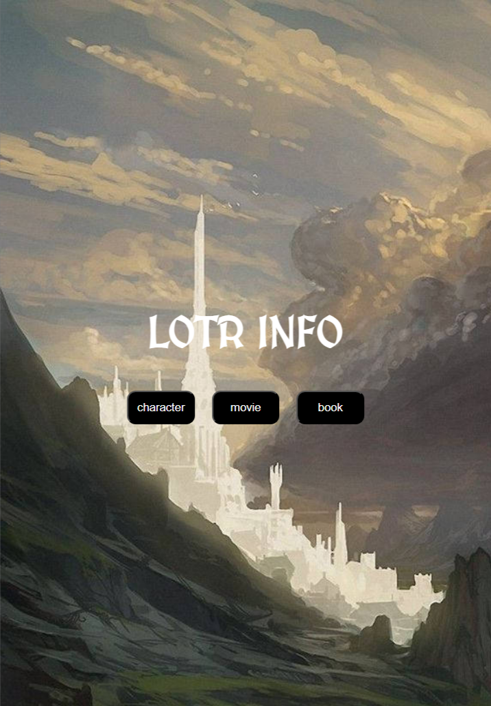

# 🧙‍♂️ LOTR Info Web

Una web interactiva que muestra información del mundo de *El Señor de los Anillos* (LOTR), incluyendo libros, películas y personajes. Utiliza la API pública [The One API](https://the-one-api.dev/) y fue desarrollada con **React**.

---

## 🚀 Funcionalidades

- 🔍 Consultar datos sobre:
  - 📚 Libros
  - 🎬 Películas
  - 👤 Personajes

- ⚡ Peticiones dinámicas usando `fetch` y hooks personalizados.
- 📱 Diseño responsive (adaptable a móviles y pantallas grandes).
- 🔐 Token API oculto mediante variables de entorno.

---

## 🛠️ Tecnologías usadas

- [React](https://reactjs.org/)
- [The One API](https://the-one-api.dev/)
- CSS Modules
- Netlify (para hosting)

---

## 🖼️ Vista previa
  

## 🌐 Proyecto en línea

([👉 Ver la calculadora en acción](https://lotr-info-react.netlify.app/))

